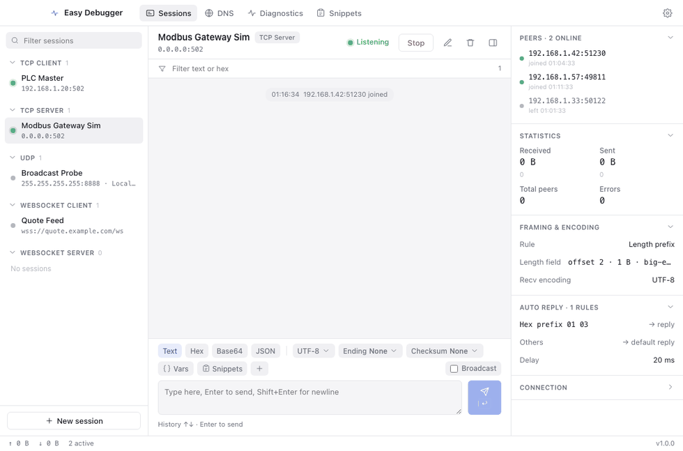
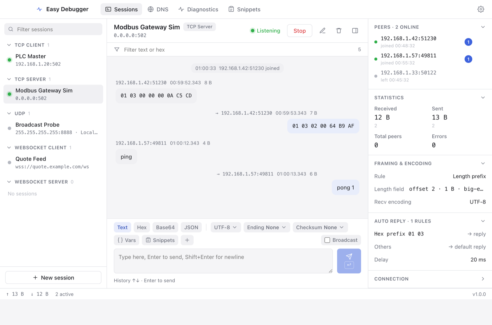
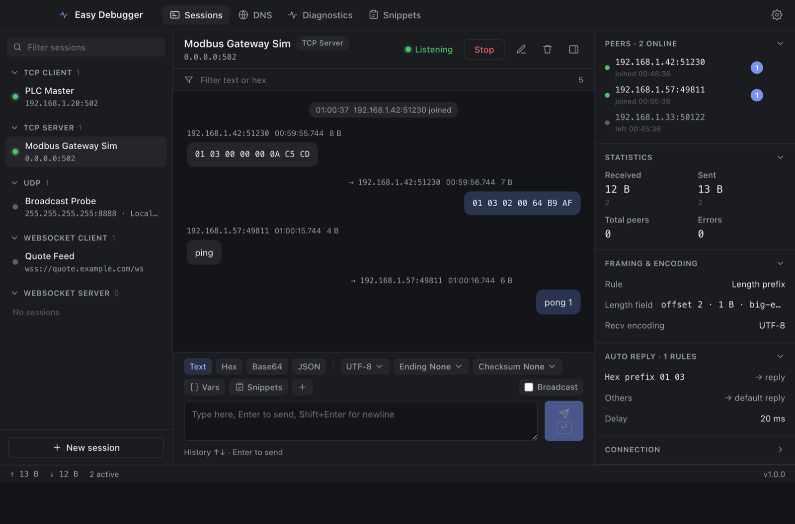
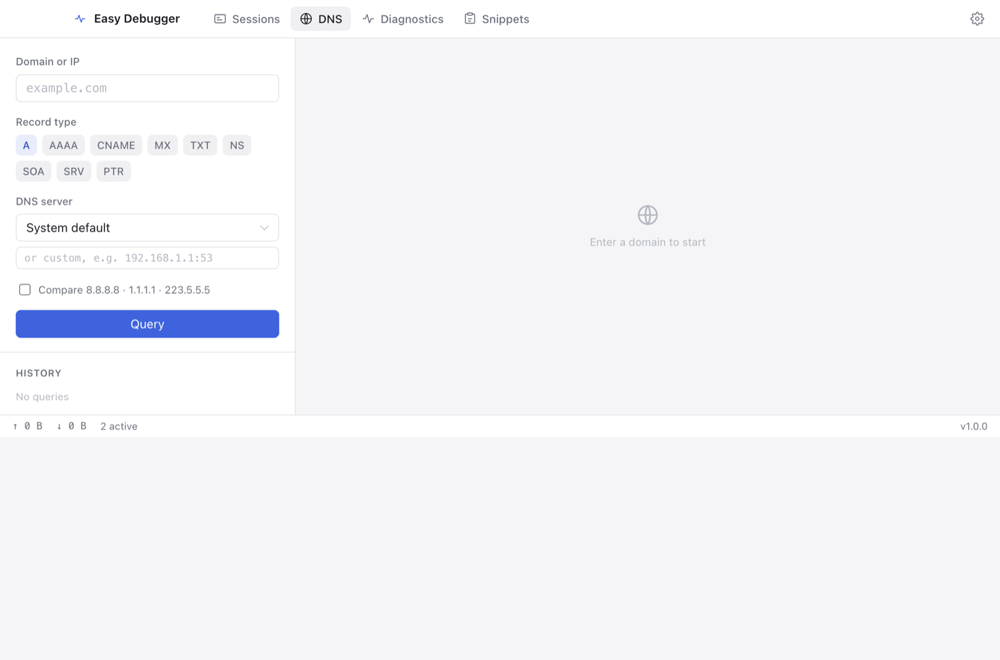
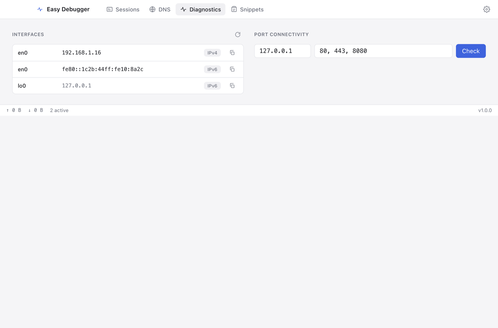
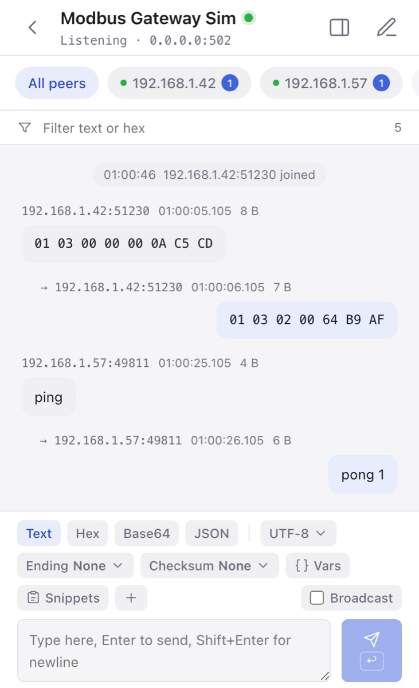
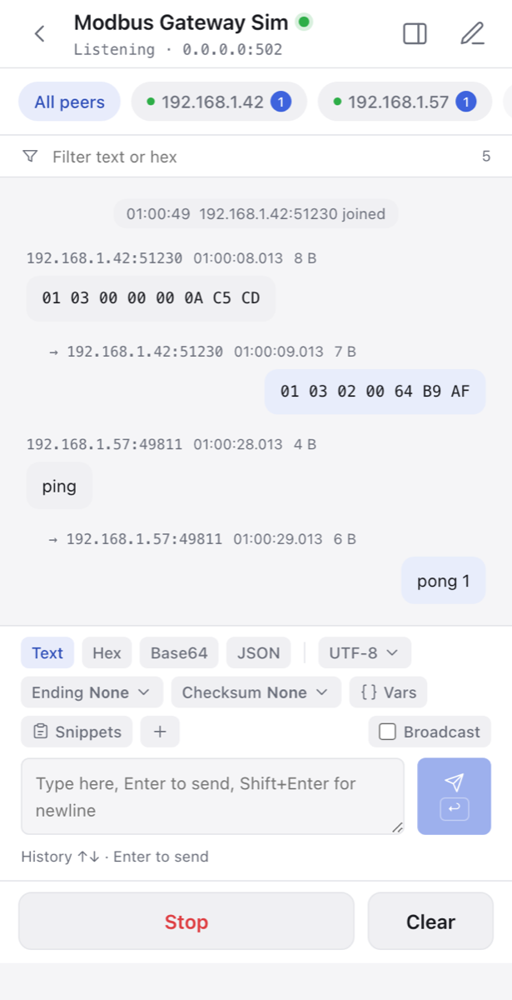
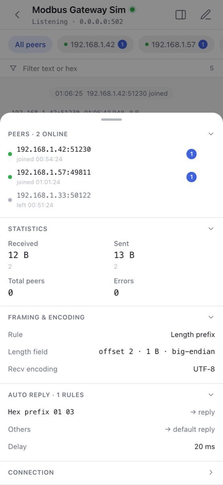

# Easy Debugger

[English](README.md) · [中文](README.zh.md)

A lightweight desktop socket debugger covering TCP, UDP and WebSocket, for both client and server sides, with built-in DNS lookup and network diagnostics. Built with Tauri 2, Rust and Vue 3: clean UI, tiny install size.

## Features

- **Connection modes**: TCP client, TCP server, UDP (unicast / broadcast / multicast), WebSocket client, WebSocket server; many sessions in parallel.
- **Message formats**: text (multiple encodings), Hex, Base64, JSON; line-ending append, CRC/XOR/SUM checksum, template variables, pre-send byte preview.
- **Receive display**: auto, text, Hex, Hex Dump, Base64, switchable per message; millisecond timestamp, byte count, peer address.
- **TCP framing**: none, delimiter, length prefix, fixed length, timeout aggregation.
- **Conversational UX**: bubble message stream, snippet library, timed send, auto-reply rules (prefix / contains / regex / hex-prefix, reply / echo / disconnect).
- **Server side**: multi-client sessions, targeted send and broadcast, kick peers, live statistics.
- **DNS tool**: A/AAAA/CNAME/MX/TXT/NS/SOA/SRV/PTR, custom and multi-server comparison, reverse lookup.
- **Network diagnostics**: local interfaces, port connectivity check.
- Light/dark theme follows the system; UI language switchable (System / 中文 / English); config persisted as JSON.

## Screenshots



### Sessions (TCP server, light & dark)





### DNS tool



### Network diagnostics



### Mobile (Android / iOS)

Single-column layout with a bottom tab bar; the info panel becomes a bottom sheet.

<p>
  
  
  
</p>

## Development

Requires Node 22+, pnpm, Rust 1.90+; on macOS the Xcode Command Line Tools.

```bash
pnpm install
pnpm tauri dev      # run in dev
pnpm tauri build    # bundle, output under src-tauri/target/release/bundle
```

## Mobile

The layout switches automatically by platform: three columns on desktop, a single column with a bottom tab bar and a bottom-sheet info panel on mobile (Android / iOS). The core Rust logic is shared across both.

Mobile builds (need the matching toolchain):

```bash
pnpm tauri android init && pnpm tauri android build   # needs Android Studio + NDK
pnpm tauri ios init && pnpm tauri ios build           # needs macOS + Xcode
```

## Testing

```bash
cd src-tauri && cargo test   # unit tests + end-to-end tests for all five transports
pnpm vue-tsc --noEmit        # frontend type check
```

## Layout

- `src/` frontend: `api/` command & event wrappers, `stores/` state, `components/` & `views/` UI, `i18n/` locales.
- `src-tauri/src/` backend: `session/` transports, `codec.rs` encode/decode, `framing.rs` framing, `dns.rs` & `net.rs` tools, `commands.rs` command layer.
- `docs/SPEC.md` full product spec (Chinese).

## License

[Apache License 2.0](/LICENSE)
