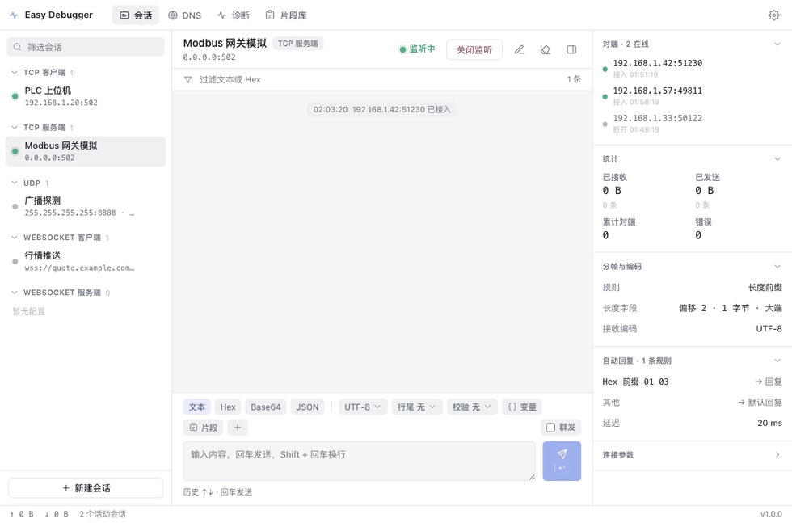
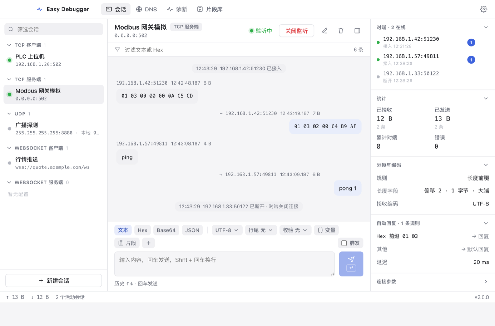
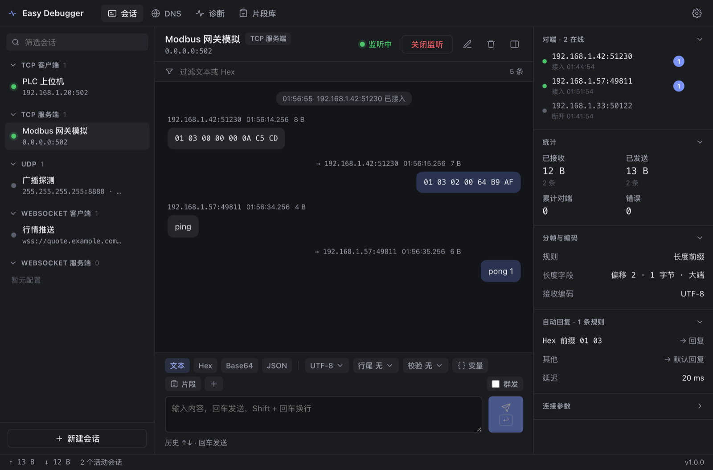
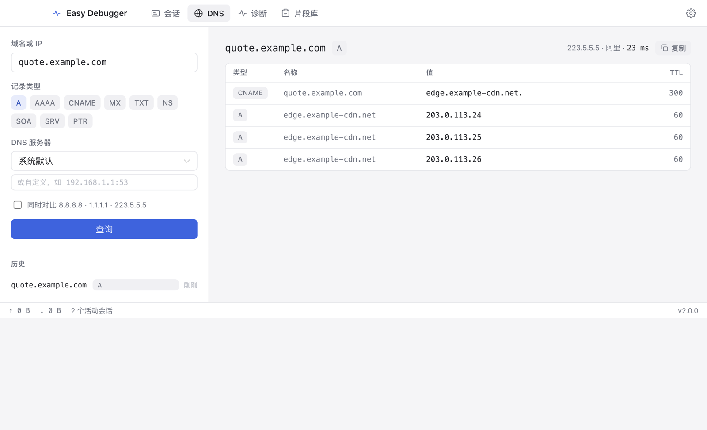
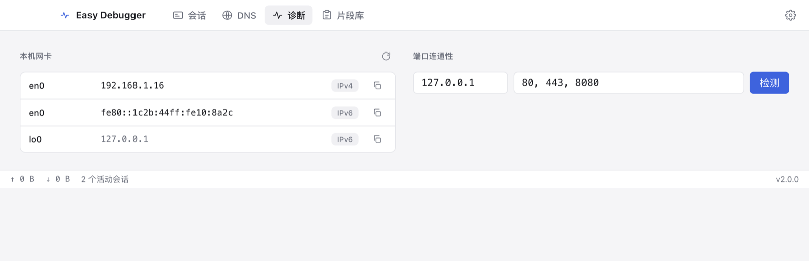
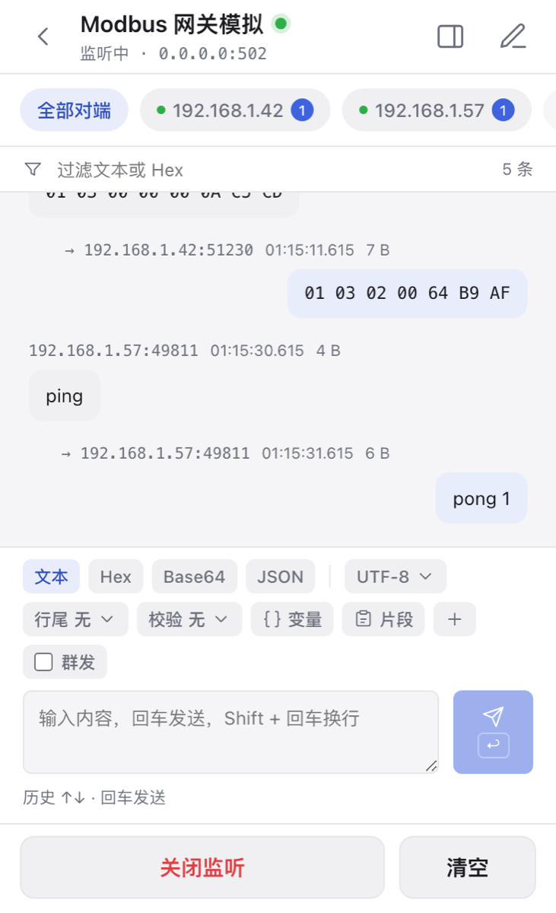
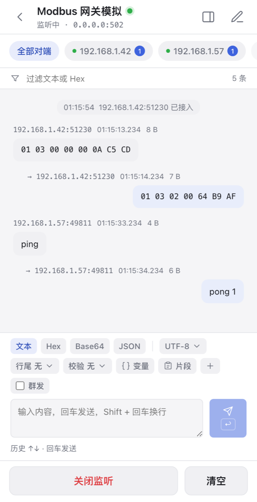
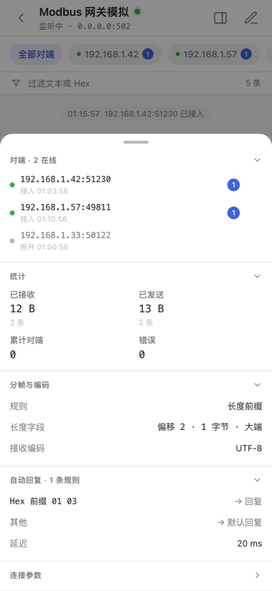

<div align="center">


# Easy Debugger

[English](README.md) · **中文**

轻量级桌面 **Socket 调试工具**，覆盖 **TCP、UDP、WebSocket** 的客户端与服务端，
内置 **DNS 查询**与**网络诊断**。
基于 Tauri 2、Rust 与 Vue 3，界面简洁，安装包小。

[](https://github.com/min-go/easy-debugger/actions/workflows/ci.yml)
[](https://github.com/min-go/easy-debugger/releases/latest)
[](LICENSE)


### [⬇ 下载最新版本](https://github.com/min-go/easy-debugger/releases/latest)



</div>

## 功能

| | |
|---|---|
| **连接模式** | TCP 客户端 / 服务端、UDP（单播 · 广播 · 组播）、WebSocket 客户端 / 服务端，多会话并行 |
| **消息格式** | 文本（多种编码）、Hex、Base64、JSON；行尾追加、CRC / XOR / SUM 校验、模板变量、发送前字节预览 |
| **接收显示** | 自动 · 文本 · Hex · Hex Dump · Base64，每条可单独切换；毫秒时间戳、字节数、对端地址 |
| **TCP 分帧** | 无分帧、分隔符、长度前缀、固定长度、超时聚合 |
| **对话式交互** | 气泡消息流、片段库、定时发送、自动回复规则（前缀 / 包含 / 正则 / Hex 前缀 → 回复 / 回显 / 断开） |
| **服务端** | 多客户端会话、定向发送与群发、踢出对端、实时统计 |
| **DNS 工具** | A / AAAA / CNAME / MX / TXT / NS / SOA / SRV / PTR，自定义与多服务器对比，反向解析 |
| **网络诊断** | 本机网卡、端口连通性检测 |
| **体验** | 亮暗主题跟随系统，界面双语（跟随系统 / 中文 / English），配置以 JSON 持久化 |

## 截图

### 会话（TCP 服务端，亮色与暗色）





### DNS 工具



### 网络诊断



### 移动端（Android / iOS）

移动端为单栏布局，底部页签导航，信息面板改为上滑抽屉。

<p>
  
  
  
</p>

## 安装

到 [最新版本](https://github.com/min-go/easy-debugger/releases/latest) 下载对应平台的安装包：

| 平台 | 文件 |
|---|---|
| macOS（Apple Silicon） | `Easy Debugger_*_aarch64.dmg` |
| macOS（Intel） | `Easy Debugger_*_x64.dmg` |
| Windows | `_x64-setup.exe` 或 `_x64_en-US.msi` |
| Linux | `_amd64.deb` · `.x86_64.rpm` · `_amd64.AppImage` |
| Android | `easy-debugger_*_android.apk` |

macOS 与 Windows 包未签名。macOS 若提示“应用已损坏”，把应用移到 `/应用程序` 后执行：

```bash
xattr -cr "/Applications/Easy Debugger.app"
codesign --force --deep --sign - "/Applications/Easy Debugger.app"
```

Windows 在 SmartScreen 提示上点 **更多信息 → 仍要运行**。

## 开发

需要 Node 22+、pnpm、Rust 1.90+，macOS 需 Xcode Command Line Tools。

```bash
pnpm install
pnpm tauri dev      # 开发运行
pnpm tauri build    # 打包 → src-tauri/target/release/bundle
```

## 移动端

界面按运行平台自动切换：桌面三栏，移动端单栏加底部页签、上滑信息面板。核心 Rust 逻辑两端共用。

```bash
pnpm tauri android init && pnpm tauri android build   # 需 Android Studio、NDK
pnpm tauri ios init && pnpm tauri ios build           # 需 macOS 与 Xcode
```

## 测试

```bash
cd src-tauri && cargo test   # 单元测试 + 五种传输的端到端测试
pnpm vue-tsc --noEmit        # 前端类型检查
```

## 目录

- `src/` 前端：`api/` 命令与事件封装，`stores/` 状态，`components/` 与 `views/` 界面，`i18n/` 语言包。
- `src-tauri/src/` 后端：`session/` 各传输实现，`codec.rs` 编解码，`framing.rs` 分帧，`dns.rs`、`net.rs` 工具，`commands.rs` 命令层。
- `docs/SPEC.md` 完整产品规格。

## License

[Apache License 2.0](LICENSE)
